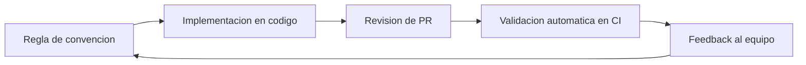
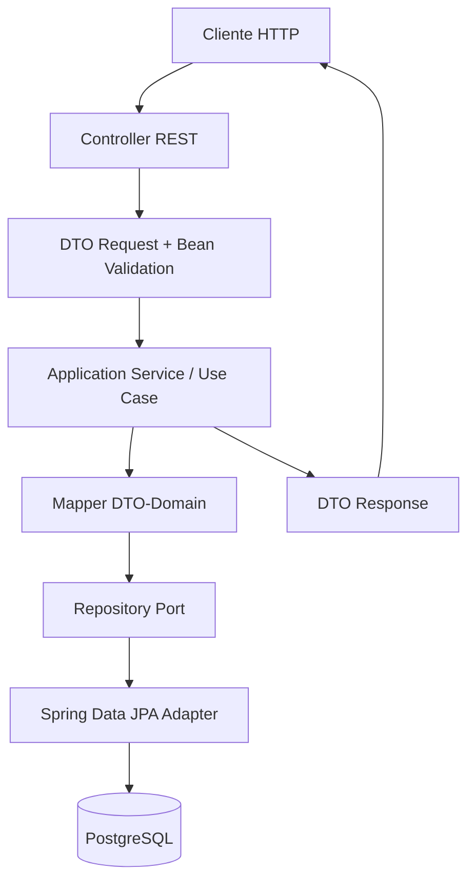
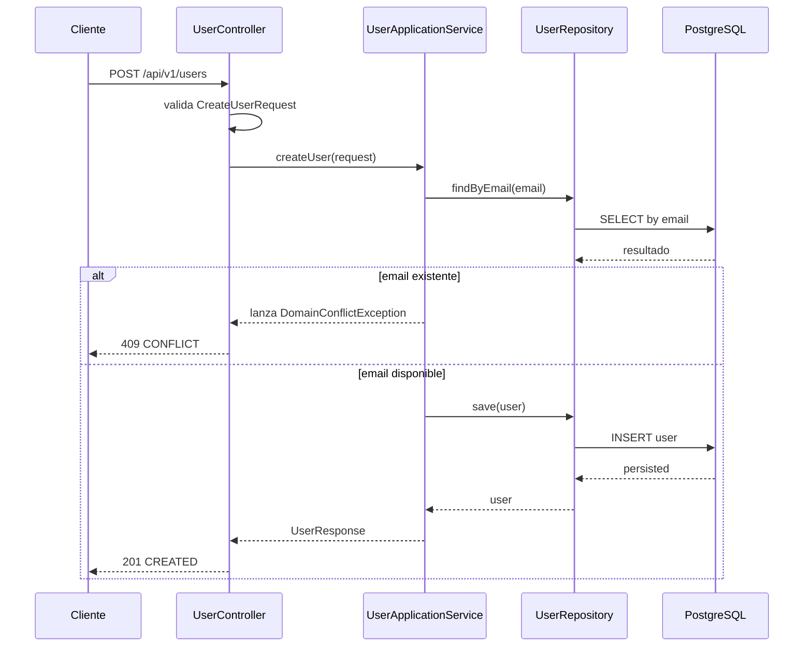
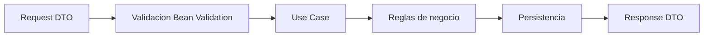

# Capitulo: Convenciones de Ingenieria para Publigana Backend

## Objetivos

Este capitulo construye la base disciplinaria del proyecto. El objetivo no es imponer reglas cosmeticas, sino establecer una forma de trabajo que haga que el sistema sea evolutivo durante anos. Al terminarlo, deberias ser capaz de:

- Entender por que las convenciones son una decision arquitectonica y no solo de estilo.
- Diseñar convenciones que reduzcan errores humanos en desarrollo, pruebas y despliegue.
- Aplicar estandares concretos en Java 21, Spring Boot 4 y PostgreSQL bajo principios de Clean Architecture y SOLID.
- Traducir criterios abstractos de calidad en reglas tecnicas verificables para Publigana.

## Introduccion

Cuando un equipo dice "seguimos buenas practicas" pero no puede describirlas con precision operativa, no tiene practicas: tiene intenciones. Las convenciones convierten intenciones en comportamiento predecible. Si se diseñan bien, reducen la carga cognitiva de cada desarrollador, permiten revisiones mas objetivas y crean un lenguaje compartido para discutir decisiones complejas.

En proyectos medianos o grandes, la mayor parte del coste no esta en escribir la primera version del codigo, sino en mantenerlo: entenderlo seis meses despues, extenderlo sin romper contratos, y corregir incidentes en produccion bajo presion. Las convenciones son la herramienta que evita que esa complejidad crezca de forma exponencial.

En Publigana, las convenciones no se limitan a formato de clases. Incluyen fronteras de arquitectura, responsabilidad de capas, politicas de seguridad, reglas de persistencia, contratos de API, estandar de errores y criterios de observabilidad. Este capitulo establece esa columna vertebral.

## Contexto historico

Durante mucho tiempo, los equipos backend crecieron sin una base de convenciones explicitas. Cada desarrollador programaba con su "estilo personal" y solo se alineaba lo minimo para compilar. Ese enfoque funcionaba en sistemas pequenos con pocos colaboradores, pero colapsaba en productos de negocio con alta rotacion de personas y ciclos de release frecuentes.

En la decada de 2000, los marcos de trabajo empresariales resolvieron problemas de infraestructura, pero introdujeron una falsa sensacion de orden: el framework daba estructura, por lo tanto el proyecto estaba bien diseñado. En realidad, muchos sistemas Spring o Java EE terminaron con clases enormes, capas acopladas y dependencias ciclicas porque faltaban reglas de diseño de equipo.

Con la madurez de practicas como DDD tactico, arquitectura hexagonal, CI/CD y DevSecOps, las convenciones evolucionaron desde "lineas en un wiki" hacia politicas que deben poder validarse: checkstyle, reglas arquitectonicas, tests de integracion, escaneo de vulnerabilidades y definiciones de contrato de API. Ese es el contexto en el que se construye Publigana: convenciones medibles, no sugerencias blandas.

## Motivacion

Publigana necesita una base que soporte crecimiento funcional: usuarios, roles, autenticacion, catalogos, flujos promocionales, auditoria, reportes y futuras integraciones. Si cada modulo se implementa con criterios distintos, el sistema pierde cohesion y el coste de cambio se vuelve impredecible.

La motivacion central de este capitulo es evitar deuda arquitectonica temprana. La deuda no aparece cuando un endpoint falla; aparece cuando cada endpoint se construye con un criterio diferente y ningun desarrollador puede anticipar como evoluciona el sistema. Las convenciones sirven para:

- Acelerar onboarding de nuevos desarrolladores.
- Reducir defectos por interpretaciones ambiguas.
- Facilitar refactorizaciones sin miedo.
- Alinear decisiones tecnicas con requisitos de seguridad y negocio.

En otras palabras, convencion no significa rigidez ciega; significa libertad controlada. El equipo puede innovar, pero dentro de limites que preservan coherencia y calidad.

## Problema que resuelve

Sin convenciones de ingenieria, los proyectos backend suelen caer en cuatro patologias:

Primero, la arquitectura se degrada gradualmente. Los controladores incorporan logica de negocio, los servicios manipulan detalles HTTP, y los repositorios resuelven casos de uso completos. El resultado es un sistema dificil de probar y aun mas dificil de modificar.

Segundo, los errores de seguridad se multiplican. Cuando no existe una politica clara para secretos, validaciones, trazabilidad de errores o sanitizacion de datos, el sistema expone informacion sensible y aumenta su superficie de ataque.

Tercero, el rendimiento se vuelve accidental. Consultas N+1, serializaciones excesivas, endpoints sin paginacion y objetos de dominio inflados no se detectan a tiempo porque no hay criterios compartidos de diseño de datos ni contratos de respuesta.

Cuarto, la comunicacion tecnica se vuelve ineficiente. Si cada PR discute temas basicos ya resueltos (nombres, estructura, validaciones, forma de mapear DTOs), el equipo pierde tiempo en decisiones que deberian estar estandarizadas.

Este capitulo resuelve ese problema definiendo convenciones con fundamento tecnico y aplicacion directa.

## Conceptos fundamentales

Una convencion util debe cumplir tres propiedades: claridad, verificabilidad y contexto. Claridad significa que dos personas distintas la interpretan igual. Verificabilidad significa que puede comprobarse en revision, test o pipeline. Contexto significa que responde a necesidades reales del proyecto, no a modas.

### Convenciones de frontera arquitectonica

En Publigana, cada capa tiene una responsabilidad:

- Controller: adaptador HTTP, transforma request/response, no contiene reglas de negocio.
- Application/Service: orquesta casos de uso, transacciones y politicas de negocio.
- Domain: modelos y reglas del negocio, independiente de infraestructura.
- Repository: persistencia y consultas; no decide flujos de negocio.

La frontera evita acoplamiento transversal. Si una clase cruza capas sin justificacion, se rompe la trazabilidad del diseño.

### Convenciones de contrato

Todo endpoint expone DTOs de entrada y salida. Nunca se retorna entidad JPA directamente. Esta regla protege al dominio de filtraciones de infraestructura y evita exposiciones accidentales de campos sensibles.

### Convenciones de validacion

Toda entrada externa se valida en el borde del sistema con Bean Validation. Las reglas de negocio profundas se validan en capa de aplicacion/dominio. Esta separacion evita duplicidad y mejora la calidad de mensajes de error.

### Convenciones de errores

Los errores tecnicos y de negocio no se mezclan. Se usa un formato consistente de respuesta para trazabilidad y soporte operativo.

### Convenciones de seguridad

No hay codigo funcional sin consideraciones de seguridad basicas: autenticacion, autorizacion, manejo de secretos, politicas de logging y control de excepciones.

## Funcionamiento interno

Las convenciones operan como un sistema de control distribuido. No viven en un unico documento: viven en codigo, revisiones, pipeline y automatizaciones.



Este ciclo crea aprendizaje continuo. Una convencion que no se aplica de forma sistematica es decorativa. Una convencion que se aplica pero no se revisa periodicamente se vuelve obsoleta. En Publigana, las convenciones son versionables y evolucionan con evidencia.

## Arquitectura

La arquitectura objetivo del capitulo es hexagonal con separacion de responsabilidades y contratos explicitos entre capas.



La clave no esta en dibujar capas, sino en preservar dependencias unidireccionales. El controlador depende de contratos de aplicacion, nunca de detalles de persistencia. El repositorio depende de infraestructura, no de HTTP. El dominio no conoce frameworks.

## Flujo paso a paso

1. El cliente envia una peticion HTTP para crear un usuario.
2. El controlador recibe un DTO inmutable y ejecuta validaciones declarativas.
3. Si el DTO es valido, delega en un servicio de aplicacion por constructor injection.
4. El servicio aplica reglas de negocio: unicidad de correo, normalizacion de datos, asignacion de rol por defecto si corresponde.
5. El servicio consulta repositorio por puertos para validar existencia previa.
6. Si no hay conflicto, persiste entidad y devuelve DTO de salida.
7. El controlador construye respuesta con codigo HTTP y payload estandar.
8. En caso de error, el manejador global transforma excepciones a un formato consistente.

Este flujo permite razonar sobre comportamiento, coste y seguridad de cada paso.

## Diagramas Mermaid





## Diagramas ASCII

```text
Entrada HTTP
	 |
	 v
+-------------------+
| UserController    |
| - valida DTO      |
| - no negocio      |
+---------+---------+
					|
					v
+-------------------+
| UserService       |
| - reglas negocio  |
| - coordina flujo  |
+---------+---------+
					|
					v
+-------------------+
| UserRepository    |
| - acceso datos    |
+---------+---------+
					|
					v
			PostgreSQL
```

```text
Reglas de convencion
	-> menos ambiguedad
	-> menos defectos
	-> mejor mantenibilidad
	-> mayor velocidad sostenible
```

## Ejemplos sencillos

Un ejemplo sencillo de convencion es la nomenclatura de endpoints y DTOs. En lugar de exponer una entidad completa, se define un contrato minimo.

Ejemplo de request:

```json
{
	"fullName": "Ana Perez",
	"email": "ana.perez@publigana.com",
	"password": "Pbl!2026Secure"
}
```

Ejemplo de response:

```json
{
	"id": 42,
	"fullName": "Ana Perez",
	"email": "ana.perez@publigana.com",
	"status": "ACTIVE"
}
```

Esta convencion evita publicar campos internos como hash de password, timestamps tecnicos o claves de relacion que no aportan al cliente.

## Ejemplos profesionales

En un entorno empresarial, las convenciones se aplican en escenarios con carga real y equipos distribuidos. Considera un flujo de alta de usuarios con politicas de seguridad y auditoria.

Reglas profesionales del ejemplo:

- El correo se normaliza a minusculas para garantizar unicidad semantica.
- La password nunca sale de la capa de aplicacion en texto plano.
- El servicio registra eventos de dominio para auditoria.
- Las respuestas de error usan un codigo funcional estable, no mensajes improvisados.

Tambien se define una convencion de idempotencia para operaciones sensibles: reintentos de cliente no deben crear duplicados cuando el correo ya existe.

## Codigo Java 21

```java
package com.publigana.application.user;

import java.time.Instant;
import java.util.Locale;
import java.util.Objects;

public final class UserFactory {

		public User create(final String fullName, final String email, final String encodedPassword, final String role) {
				Objects.requireNonNull(fullName, "fullName no puede ser null");
				Objects.requireNonNull(email, "email no puede ser null");
				Objects.requireNonNull(encodedPassword, "encodedPassword no puede ser null");
				Objects.requireNonNull(role, "role no puede ser null");

				final var normalizedName = fullName.strip();
				final var normalizedEmail = email.strip().toLowerCase(Locale.ROOT);

				return new User(
								null,
								normalizedName,
								normalizedEmail,
								encodedPassword,
								role,
								true,
								Instant.now()
				);
		}

		public record User(
						Long id,
						String fullName,
						String email,
						String passwordHash,
						String role,
						boolean active,
						Instant createdAt
		) {
		}
}
```

## Codigo Spring Boot 4

```java
package com.publigana.controller;

import com.publigana.dto.CreateUserRequest;
import com.publigana.dto.UserResponse;
import com.publigana.service.UserApplicationService;
import jakarta.validation.Valid;
import org.springframework.http.HttpStatus;
import org.springframework.http.ResponseEntity;
import org.springframework.web.bind.annotation.PostMapping;
import org.springframework.web.bind.annotation.RequestBody;
import org.springframework.web.bind.annotation.RequestMapping;
import org.springframework.web.bind.annotation.RestController;

@RestController
@RequestMapping("/api/v1/users")
public class UserController {

		private final UserApplicationService userApplicationService;

		public UserController(final UserApplicationService userApplicationService) {
				this.userApplicationService = userApplicationService;
		}

		@PostMapping
		public ResponseEntity<UserResponse> createUser(@Valid @RequestBody final CreateUserRequest request) {
				final var createdUser = userApplicationService.createUser(request);
				return ResponseEntity.status(HttpStatus.CREATED).body(createdUser);
		}
}
```

```java
package com.publigana.dto;

import jakarta.validation.constraints.Email;
import jakarta.validation.constraints.NotBlank;
import jakarta.validation.constraints.Pattern;
import jakarta.validation.constraints.Size;

public record CreateUserRequest(
				@NotBlank(message = "El nombre es obligatorio")
				@Size(min = 3, max = 120, message = "El nombre debe tener entre 3 y 120 caracteres")
				String fullName,

				@NotBlank(message = "El correo es obligatorio")
				@Email(message = "El correo no tiene formato valido")
				String email,

				@NotBlank(message = "La contrasena es obligatoria")
				@Size(min = 12, max = 128, message = "La contrasena debe tener entre 12 y 128 caracteres")
				@Pattern(
								regexp = "^(?=.*[A-Z])(?=.*[a-z])(?=.*\\d)(?=.*[@#$%^&+=!]).*$",
								message = "La contrasena debe incluir mayuscula, minuscula, numero y simbolo"
				)
				String password
) {
}
```

```java
package com.publigana.dto;

public record UserResponse(
				Long id,
				String fullName,
				String email,
				String status
) {
}
```

```java
package com.publigana.repository;

import com.publigana.entity.Usuario;
import org.springframework.data.jpa.repository.JpaRepository;

import java.util.Optional;

public interface UserRepository extends JpaRepository<Usuario, Long> {
		Optional<Usuario> findByCorreo(String correo);
}
```

```java
package com.publigana.service;

import com.publigana.dto.CreateUserRequest;
import com.publigana.dto.UserResponse;
import com.publigana.entity.Usuario;
import com.publigana.exception.DomainConflictException;
import com.publigana.repository.UserRepository;
import org.springframework.security.crypto.password.PasswordEncoder;
import org.springframework.stereotype.Service;
import org.springframework.transaction.annotation.Transactional;

import java.util.Locale;

@Service
public class UserApplicationService {

		private final UserRepository userRepository;
		private final PasswordEncoder passwordEncoder;

		public UserApplicationService(final UserRepository userRepository, final PasswordEncoder passwordEncoder) {
				this.userRepository = userRepository;
				this.passwordEncoder = passwordEncoder;
		}

		@Transactional
		public UserResponse createUser(final CreateUserRequest request) {
				final var normalizedEmail = request.email().trim().toLowerCase(Locale.ROOT);

				userRepository.findByCorreo(normalizedEmail)
								.ifPresent(existing -> {
										throw new DomainConflictException("Ya existe un usuario con ese correo");
								});

				final var entity = new Usuario();
				entity.setNombres(request.fullName().trim());
				entity.setCorreo(normalizedEmail);
				entity.setPassword(passwordEncoder.encode(request.password()));
				entity.setEstado(Boolean.TRUE);

				final var persisted = userRepository.save(entity);

				return new UserResponse(
								persisted.getIdUsuario().longValue(),
								persisted.getNombres(),
								persisted.getCorreo(),
								Boolean.TRUE.equals(persisted.getEstado()) ? "ACTIVE" : "INACTIVE"
				);
		}
}
```

## Explicacion linea por linea

Comenzamos con el bloque Java 21 de fabrica de usuario. La clase `UserFactory` es final para comunicar que no existe variabilidad por herencia; su rol es construir agregados con reglas basicas de normalizacion. El metodo `create` recibe entradas primitivas para reducir acoplamiento con frameworks. `Objects.requireNonNull` falla temprano si algun dato obligatorio es nulo, evitando errores tardios mas ambiguos. La normalizacion con `strip()` y `toLowerCase(Locale.ROOT)` elimina inconsistencias de espacios y casing regional. El record interno `User` define un modelo inmutable y expresivo: los records en Java 21 reducen codigo ceremonial y mejoran legibilidad del contrato.

Pasando al controlador Spring, `@RestController` y `@RequestMapping` fijan el adaptador HTTP. La dependencia `UserApplicationService` llega por constructor injection, cumpliendo inversion de dependencias y facilitando pruebas. En el metodo `createUser`, `@Valid` dispara Bean Validation antes de entrar a negocio. Si falla, el controlador no ejecuta logica de aplicacion. Si pasa, delega en servicio y retorna `201 Created`, codigo semantico correcto para alta de recurso.

En `CreateUserRequest`, cada anotacion tiene una responsabilidad puntual. `@NotBlank` evita strings vacias o solo espacios. `@Size` define limites de longitud que protegen dominio y base de datos. `@Email` valida formato sintactico inicial. `@Pattern` impone complejidad minima de password; no reemplaza politicas de seguridad avanzadas, pero bloquea entradas triviales.

`UserResponse` encapsula solo informacion que el cliente necesita. Este desacople evita que cambios internos de entidad rompan API externa.

En repositorio, `findByCorreo` traduce una necesidad de negocio a contrato de persistencia. El servicio no escribe SQL ni conoce detalles del ORM; solo consume un puerto orientado a intencion.

`UserApplicationService` concentra reglas del caso de uso. `@Transactional` protege atomicidad: o se completa el alta o se revierte todo. Se normaliza correo antes de consultar para garantizar comparacion estable. `ifPresent` con excepcion de dominio aplica fail-fast para conflictos. Se codifica password con `PasswordEncoder`, evitando almacenar texto plano. El mapeo final a `UserResponse` traduce estado tecnico a semantica de API.

Este conjunto de clases demuestra las convenciones clave de Publigana: responsabilidades claras, DTOs explicitos, validacion temprana, inyeccion por constructor, patron repositorio y seguridad basica integrada en el flujo.

## Buenas practicas

Una buena practica en convenciones no es una receta aislada; es una decision repetible con beneficio acumulativo. La primera es escribir convenciones como reglas accionables. "Usar nombres claros" es debil; "todo servicio termina en Service y expresa caso de uso en verbo de dominio" es verificable.

La segunda es aplicar convenciones en plantillas iniciales y ejemplos oficiales del repositorio. Si el codigo base contradice las reglas, el equipo seguira el codigo, no el documento.

La tercera es separar convenciones obligatorias de recomendaciones. Las obligatorias impactan arquitectura, seguridad y contratos externos. Las recomendaciones pueden variar por contexto.

La cuarta es revisar convenciones con datos: defectos repetidos, incidentes, tiempos de review y lead time. Si una regla no mejora estos indicadores, debe replantearse.

## Malas practicas

La peor mala practica es la convencion ornamental: reglas largas que nadie aplica. Tambien es problematica la sobreconvencion, donde se normaliza todo al punto de bloquear decisiones sensatas para casos especiales.

Otra mala practica es mezclar convenciones de producto con preferencias personales. Decidir tabs o espacios es menor; decidir politicas de validacion, manejo de errores y fronteras de capa es estructural.

Tambien es un error grave permitir excepciones sin trazabilidad. Si una clase rompe una convencion por necesidad real, debe quedar documentada con justificacion y fecha de revision.

## Consideraciones de rendimiento

Las convenciones impactan rendimiento en varios niveles. En CPU, evitar mapeos innecesarios y validaciones duplicadas reduce trabajo por request. En memoria, DTOs acotados minimizan payloads y objetos transitorios. En base de datos, reglas de consulta explicitas previenen patrones N+1 y sobrecarga del pool de conexiones.

Desde coste computacional, una convencion de paginacion por defecto en listados evita respuestas masivas que degradan throughput. Desde escalabilidad, una convencion de idempotencia para operaciones de escritura reduce duplicados y conflictos en escenarios de reintento.

Recomendacion concreta para Publigana: cualquier endpoint de consulta potencialmente creciente debe definir limite maximo, orden estable e indices alineados al patron de busqueda.

## Consideraciones de seguridad

Una convencion sin seguridad integrada es incompleta. Las convenciones de Publigana deben cubrir autenticacion, autorizacion, proteccion de datos y observabilidad segura.

Primero, entrada siempre validada y saneada. Segundo, secretos gestionados fuera del codigo fuente. Tercero, passwords hasheadas con algoritmo robusto como BCrypt o Argon2 segun politica. Cuarto, errores de negocio y tecnicos sin filtrar informacion sensible.

En logging, la convencion es clara: nunca registrar passwords, tokens completos o datos personales innecesarios. El objetivo de un log es diagnosticar, no duplicar la base de datos en texto plano.

## Errores comunes

Un error frecuente es considerar DTO como sobreingenieria en etapas tempranas. Esa omision genera acoplamiento inmediato entre entidad y API, que luego es costoso revertir. Otro error es ubicar validaciones de negocio en controlador, creando duplicacion y baja reutilizacion.

Tambien es habitual confundir excepciones tecnicas con conflictos de dominio. Si todo error termina en 500, el cliente no puede actuar de forma inteligente. Por ultimo, muchos equipos adoptan constructor injection en teoria pero usan field injection en casos "rapidos"; esa inconsistencia deteriora pruebas y diseño.

## Casos reales utilizados en empresas

En fintechs, una convencion central es la inmutabilidad de eventos de negocio y trazabilidad de cambios. Esto reduce disputas operativas y mejora cumplimiento regulatorio. En e-commerce, las convenciones de idempotencia y versionado de API han evitado cobros duplicados en picos de trafico. En plataformas SaaS B2B, convenciones de multi-tenant y aislamiento de datos han sido determinantes para escalar sin incidentes de seguridad.

Un patron comun en empresas maduras es tratar las convenciones como producto interno: tienen backlog, versionado, owners y metricas. No dependen de memoria informal del equipo.

## Aplicacion directa en el proyecto Publigana

En Publigana, estas convenciones se aplicaran desde el proximo modulo funcional de usuarios y roles. Cada endpoint nuevo debera declarar DTO de entrada y salida, validaciones de Bean Validation y errores estandarizados. La capa de servicio implementara reglas de negocio sin exponer detalles de JPA o HTTP.

Para seguridad, toda credencial se tratara segun politica de hashing y no exposicion. Para persistencia, cada consulta con potencial de crecimiento llevara estrategia de paginacion e indice asociado en PostgreSQL. Para arquitectura, cualquier dependencia que cruce capas sin razon explicita sera rechazada en review.

Este enfoque hara que Publigana conserve coherencia cuando se incorporen nuevos desarrolladores, nuevos modulos y nuevas integraciones externas.

## Ejercicios practicos

1. Define una convencion formal para endpoints de lectura con filtros y paginacion, incluyendo nombre de parametros, limites y codigos de error.
2. Refactoriza un caso de uso hipotetico donde el controlador contiene logica de negocio y separalo en DTO, servicio y repositorio.
3. Diseña una politica de errores para conflictos de dominio, validacion y fallos tecnicos con ejemplos de payload JSON.
4. Escribe un checklist de revision de PR para Publigana con diez reglas obligatorias y justificacion tecnica de cada una.
5. Propone una estrategia para medir cumplimiento de convenciones en CI sin generar falsos positivos excesivos.

## Preguntas de entrevista tecnica

1. Cual es la diferencia entre una convencion de estilo y una convencion arquitectonica.
2. Por que retornar entidades JPA directamente puede convertirse en un problema de seguridad y mantenimiento.
3. Que ventajas y desventajas tiene usar records de Java 21 para DTOs y modelos inmutables.
4. Como justificarias constructor injection frente a field injection en terminos de pruebas y acoplamiento.
5. Que estrategias usarias para evitar que una convencion se vuelva burocratica y pierda valor.
6. Como relacionas idempotencia con robustez de APIs en sistemas distribuidos.
7. En que casos una excepcion de dominio deberia mapearse a 409 y no a 500.

## Referencias recomendadas

- Robert C. Martin. Clean Architecture.
- Eric Evans. Domain-Driven Design.
- Vaughn Vernon. Implementing Domain-Driven Design.
- Spring Security Reference Documentation.
- Martin Fowler. Patterns of Enterprise Application Architecture.
- OWASP Application Security Verification Standard.

## Resumen

Las convenciones de Publigana no son reglas esteticas; son mecanismos de control de complejidad. Definen como se separan responsabilidades, como se construyen contratos, como se validan entradas y como se protege el sistema desde el diseño. Cuando se aplican con disciplina, permiten evolucion rapida sin sacrificar mantenibilidad, seguridad ni rendimiento.

## Proximo capitulo

En el siguiente capitulo se desarrollara la tabla de contenidos global como mapa curricular tecnico del libro, conectando cada bloque con objetivos de competencia profesional para backend enterprise en Publigana.
