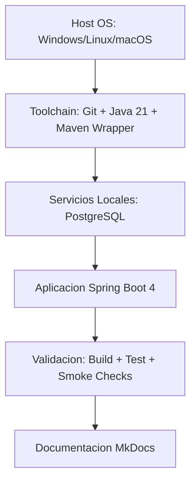
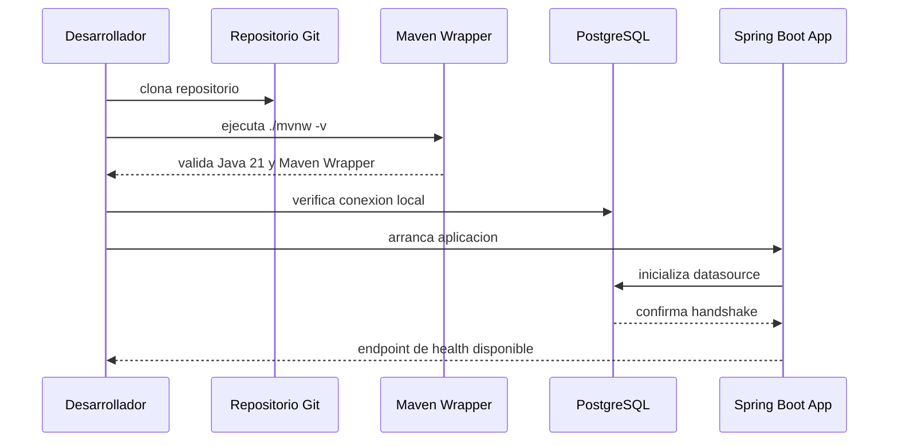

# Capitulo: Instalacion y Entorno Profesional para Publigana Backend

## Objetivos

- Diseñar un entorno de desarrollo reproducible para Java 21, Spring Boot 4, PostgreSQL y herramientas de documentacion.
- Entender por que un entorno consistente reduce deuda tecnica, errores de integracion y vulnerabilidades.
- Implementar un flujo local que sea compatible con CI/CD y produccion desde el primer dia.
- Establecer criterios de seguridad y rendimiento en la etapa de instalacion, no como correccion tardia.

## Introduccion

En equipos empresariales, el primer gran riesgo tecnico no aparece en la logica de negocio, sino en la inconsistencia del entorno. Cuando dos desarrolladores ejecutan el mismo proyecto con versiones distintas de JDK, Maven, PostgreSQL o variables de entorno no estandarizadas, se generan defectos de comportamiento no determinista: compila en una maquina y falla en otra, pasa pruebas localmente y cae en pipeline, o funciona en desarrollo pero rompe en despliegue.

Este capitulo establece un modelo de instalacion profesional para Publigana Backend con una premisa central: el entorno es parte del producto. Si el entorno no es confiable, la arquitectura tampoco lo sera.

## Contexto historico

Antes de la madurez de DevOps y la infraestructura como codigo, los equipos trabajaban con "manuales de instalacion" informales: correos, wikis desactualizadas o conocimiento tribal. Ese modelo causaba:

- Alta dependencia de personas clave.
- Onboarding lento (dias o semanas para levantar un entorno estable).
- Ambientes irreproducibles.
- Defectos de seguridad por configuraciones locales inseguras replicadas en otros entornos.

Con la evolucion hacia Integracion Continua, Contenedores y GitOps, surgio una practica clave: "environment parity". La idea es que desarrollo, pruebas y produccion compartan el mismo comportamiento operativo, cambiando solo variables externas (secretos, endpoints, recursos), no la semantica del sistema.

Publigana adopta este enfoque desde la base.

## Problema que resuelve

Un proceso de instalacion profesional resuelve cinco problemas recurrentes:

1. Divergencia de versiones
2. Configuracion insegura de secretos
3. Dependencias transitorias no controladas
4. Errores de encoding, locale y zona horaria
5. Diferencias entre entorno local y pipeline

Sin resolver estos puntos, los capitulos avanzados de arquitectura, seguridad y rendimiento no son sostenibles.

## Conceptos fundamentales

### Reproducibilidad

Capacidad de levantar el mismo entorno, con los mismos resultados, en cualquier maquina autorizada.

### Trazabilidad

Toda decision de entorno debe quedar versionada: dependencias, versiones, comandos y configuraciones.

### Inmutabilidad parcial

El codigo fuente es inmutable por commit; la configuracion cambia por perfil y variables de entorno, sin modificar binarios.

### Paridad de ambientes

Desarrollo debe emular produccion en componentes criticos: motor de BD, version de JDK, politicas de seguridad, time zone y convenciones de build.

### Shift-left de seguridad

Seguridad temprana: evitar secretos hardcoded, puertos expuestos sin necesidad, credenciales por defecto, y dependencias sin control de vulnerabilidades.

## Funcionamiento interno

El proceso completo de entorno para Publigana se puede modelar en cinco capas:



Cada capa valida precondiciones de la siguiente:

- Si la toolchain falla, no tiene sentido arrancar la aplicacion.
- Si la base de datos no responde, la aplicacion no debe continuar con estado inconsistente.
- Si build y test fallan, la documentacion no debe publicarse como si fuera valida.

### Secuencia operativa del arranque local



### Diagrama ASCII de dependencias operativas

```text
+----------------------+        +-----------------------+
|  Estacion de trabajo |        |   Control de version  |
|  (Dev Machine)       |<------>|         Git           |
+----------+-----------+        +-----------------------+
		   |
		   v
+----------------------+        +-----------------------+
| Java 21 + Maven W.   |------->| Build reproducible    |
+----------+-----------+        +-----------------------+
		   |
		   v
+----------------------+        +-----------------------+
| PostgreSQL local     |<------>| Spring Boot Backend   |
+----------------------+        +-----------------------+
```

## Ejemplos sencillos

### Ejemplo 1: validacion minima de entorno

```bash
java -version
./mvnw -version
```

Objetivo:

- Confirmar runtime Java.
- Confirmar que el proyecto usa Maven Wrapper y no depende de Maven global.

### Ejemplo 2: smoke check de aplicacion

```bash
./mvnw clean test
./mvnw spring-boot:run
```

Objetivo:

- Verificar compilacion y pruebas antes de ejecutar.
- Levantar aplicacion en modo local controlado.

## Ejemplos empresariales

### Ejemplo empresarial 1: politicas de variables de entorno

En entorno corporativo no se permiten secretos en archivos versionados.

```text
SPRING_DATASOURCE_URL=jdbc:postgresql://localhost:5432/publigana
SPRING_DATASOURCE_USERNAME=publigana_app
SPRING_DATASOURCE_PASSWORD=<secreto>
SPRING_PROFILES_ACTIVE=dev
JAVA_TOOL_OPTIONS=-Duser.timezone=UTC -Dfile.encoding=UTF-8
```

### Ejemplo empresarial 2: validacion pre-commit del entorno

```bash
./mvnw -q -DskipTests=false test
mkdocs build --strict
```

Beneficio:

- Se detectan roturas de codigo y documentacion antes de integrar a rama compartida.

## Codigo Java 21

### Ejemplo: verificador de precondiciones de entorno

```java
package com.publigana.util;

import java.nio.charset.Charset;
import java.time.ZoneId;
import java.util.List;
import java.util.Optional;

public final class EnvironmentGuard {

	private static final String REQUIRED_JAVA_VERSION_PREFIX = "21";
	private static final String REQUIRED_ENCODING = "UTF-8";
	private static final ZoneId REQUIRED_ZONE = ZoneId.of("UTC");

	private EnvironmentGuard() {
	}

	public static List<String> validate() {
		var errors = new java.util.ArrayList<String>();

		if (!System.getProperty("java.version", "").startsWith(REQUIRED_JAVA_VERSION_PREFIX)) {
			errors.add("Java 21 es obligatorio para Publigana Backend.");
		}

		var defaultCharset = Charset.defaultCharset().displayName();
		if (!REQUIRED_ENCODING.equalsIgnoreCase(defaultCharset)) {
			errors.add("Encoding invalido: se requiere UTF-8 y se encontro " + defaultCharset);
		}

		var systemZone = ZoneId.systemDefault();
		if (!REQUIRED_ZONE.equals(systemZone)) {
			errors.add("Zona horaria invalida: se requiere UTC y se encontro " + systemZone);
		}

		Optional.ofNullable(System.getenv("SPRING_PROFILES_ACTIVE"))
				.filter(profile -> !profile.isBlank())
				.orElseGet(() -> {
					errors.add("Debe definirse SPRING_PROFILES_ACTIVE.");
					return "";
				});

		return List.copyOf(errors);
	}
}
```

### Explicacion linea por linea (Java)

1. `package com.publigana.util;`: ubica la clase en utilidades tecnicas de infraestructura local.
2. Imports de `Charset`, `ZoneId`, `List` y `Optional`: dependencias minimas para validar condiciones del sistema.
3. `public final class EnvironmentGuard`: clase final para evitar herencia accidental en un componente utilitario.
4. `REQUIRED_JAVA_VERSION_PREFIX`: establece contrato de version minimo de runtime.
5. `REQUIRED_ENCODING`: fija UTF-8 para eliminar variaciones de lectura/escritura.
6. `REQUIRED_ZONE`: fuerza UTC para coherencia temporal en logs y persistencia.
7. Constructor privado: evita instanciacion, porque la clase expone solo metodos estaticos.
8. `validate()`: punto de entrada unico que retorna lista de incumplimientos.
9. `errors`: acumulador mutable local, despues encapsulado como inmutable.
10. `System.getProperty("java.version")`: inspecciona version del runtime en ejecucion.
11. Validacion `startsWith("21")`: protege compatibilidad con caracteristicas de Java 21.
12. `Charset.defaultCharset()`: detecta encoding efectivo del sistema.
13. Comparacion con UTF-8: evita corrupcion de caracteres y diferencias regionales.
14. `ZoneId.systemDefault()`: inspecciona zona horaria real del host.
15. Comparacion con UTC: minimiza errores de conversion de fechas en ambientes distribuidos.
16. `Optional.ofNullable(System.getenv(...))`: lectura segura de variable de entorno.
17. `filter(!isBlank())`: acepta solo perfil valido no vacio.
18. `orElseGet(...)`: agrega error cuando falta perfil activo.
19. `List.copyOf(errors)`: retorna estructura inmutable para no exponer estado interno.

## Codigo Spring Boot 4

### Ejemplo: endpoint de diagnostico de entorno al arranque

```java
package com.publigana.controller;

import com.publigana.util.EnvironmentGuard;
import org.springframework.http.HttpStatus;
import org.springframework.http.ResponseEntity;
import org.springframework.web.bind.annotation.GetMapping;
import org.springframework.web.bind.annotation.RequestMapping;
import org.springframework.web.bind.annotation.RestController;

import java.util.Map;

@RestController
@RequestMapping("/api/v1/environment")
public class EnvironmentController {

	@GetMapping("/check")
	public ResponseEntity<Map<String, Object>> check() {
		var violations = EnvironmentGuard.validate();
		if (violations.isEmpty()) {
			return ResponseEntity.ok(Map.of(
					"status", "READY",
					"message", "Entorno valido para desarrollo empresarial"
			));
		}

		return ResponseEntity.status(HttpStatus.PRECONDITION_FAILED).body(Map.of(
				"status", "NOT_READY",
				"violations", violations
		));
	}
}
```

### Explicacion linea por linea (Spring Boot)

1. `package com.publigana.controller;`: define adaptador de entrada HTTP.
2. `import com.publigana.util.EnvironmentGuard;`: reutiliza validaciones centralizadas.
3. Imports de `ResponseEntity`, `HttpStatus` y anotaciones web: construccion de endpoint REST.
4. `@RestController`: habilita serializacion JSON automatica en respuestas.
5. `@RequestMapping("/api/v1/environment")`: versiona y agrupa el recurso.
6. `check()`: operacion idempotente de consulta del estado del entorno.
7. `violations = EnvironmentGuard.validate()`: ejecuta reglas definidas en una sola fuente.
8. `if (violations.isEmpty())`: camino feliz, entorno apto.
9. `ResponseEntity.ok(Map.of(...))`: respuesta 200 con payload minimo y claro.
10. `status PRECONDITION_FAILED (412)`: indica que faltan precondiciones para operar.
11. `violations`: devuelve lista accionable para corregir el entorno.

## Casos reales

### Caso 1: fallo intermitente por zona horaria

Sintoma:

- Tests de fechas pasan en UTC y fallan en GMT-5.

Causa raiz:

- `ZoneId.systemDefault()` no controlada.

Tratamiento:

- Forzar `-Duser.timezone=UTC` localmente y en CI.

### Caso 2: caracteres corruptos en nombres de usuario

Sintoma:

- Tildes y caracteres especiales se guardan/leen incorrectamente.

Causa raiz:

- Entorno con encoding diferente a UTF-8.

Tratamiento:

- Homologar `file.encoding=UTF-8` en ejecucion y compilacion.

### Caso 3: build exitoso local, fallo en pipeline

Sintoma:

- Localmente compila; CI falla por version de Java distinta.

Causa raiz:

- Dependencia en instalacion global y ausencia de verificacion temprana.

Tratamiento:

- Estandarizar Java 21 y validar con chequeo automatico.

## Buenas practicas

- Usar Maven Wrapper (`mvnw`) como unica via oficial de build.
- Forzar zona horaria UTC y encoding UTF-8 en todos los entornos.
- Configurar secretos via variables de entorno o gestor de secretos, nunca en repositorio.
- Automatizar validaciones de entorno antes de arrancar la aplicacion.
- Documentar cada precondicion tecnica de manera ejecutable (comandos y checks).
- Mantener una politica de version minima soportada por herramienta.

## Malas practicas

- Confiar en "en mi maquina funciona" como criterio de aceptacion.
- Mezclar configuracion de desarrollo y produccion en un mismo archivo sin perfiles.
- Exponer credenciales reales en archivos versionados.
- Modificar comportamiento por IDE en lugar de configurar build reproducible.
- Saltar pruebas para acelerar arranque local de forma sistematica.

## Rendimiento

La instalacion impacta rendimiento de manera directa:

- JVM incorrecta o flags no homologados afectan tiempo de arranque y GC.
- PostgreSQL sin configuracion basica (pool, conexiones, locale) aumenta latencia y timeouts.
- Dependencias no cacheadas en CI incrementan tiempo de build.

Recomendaciones tecnicas de base:

- Activar cache de dependencias Maven en CI.
- Definir tamano de pool de conexiones acorde al entorno.
- Mantener perfiles separados para logging de desarrollo y produccion.
- Evitar `spring.jpa.show-sql=true` en ambientes no locales.

## Seguridad

Controles minimos obligatorios durante instalacion:

1. Secretos fuera del repositorio.
2. Principio de minimo privilegio en usuario de base de datos.
3. Dependencias monitoreadas por vulnerabilidades conocidas.
4. Endpoints de diagnostico sin exposicion de informacion sensible.
5. Configuracion de red local restringida (evitar puertos abiertos innecesarios).

Riesgos OWASP relacionados con mala instalacion:

- Security Misconfiguration.
- Identification and Authentication Failures.
- Vulnerable and Outdated Components.

## Errores comunes

1. Instalar una version de Java superior/inferior y asumir compatibilidad total.
2. Usar usuario `postgres` para toda operacion de aplicacion.
3. No separar perfil `dev` de `prod`.
4. Omitir validaciones de entorno y diagnosticar tarde en QA.
5. Publicar documentacion sin `mkdocs build --strict`.

## Ejercicios

1. Implementa una validacion adicional en `EnvironmentGuard` para verificar `SPRING_DATASOURCE_URL`.
2. Crea una prueba automatizada que falle cuando la zona horaria no sea UTC.
3. Diseña una politica de credenciales para `dev`, `staging` y `prod` usando variables de entorno.
4. Simula un error de encoding y documenta el procedimiento de deteccion y correccion.
5. Define un checklist de onboarding para nuevos desarrolladores en menos de 20 minutos.

## Preguntas de entrevista

1. Por que un entorno reproducible es un requisito arquitectonico y no operativo.
2. Diferencia entre configuracion mutable y binario inmutable.
3. Que riesgos introduces al guardar secretos en archivos de configuracion versionados.
4. Como garantizar paridad entre desarrollo y produccion sin perder velocidad.
5. Que metricas usarias para medir la salud del proceso de instalacion de un equipo.

## Como se aplicara este conocimiento en Publigana

En Publigana, este capitulo define el contrato operativo de entrada para cualquier modulo nuevo (usuarios, roles, autenticacion, catalogos, reportes). Ninguna funcionalidad avanzara a implementacion sin pasar primero por estas condiciones:

- Entorno validado automaticamente (Java 21, UTC, UTF-8, perfil activo).
- Conexion a PostgreSQL con credenciales no hardcoded y permisos minimos.
- Build y test ejecutables de forma identica en local y CI.
- Documentacion compilable en modo estricto.

Impacto directo en la evolucion del proyecto:

- Onboarding mas rapido para nuevos integrantes.
- Menor tasa de defectos por configuracion.
- Mejor capacidad de auditoria y cumplimiento.
- Base estable para introducir seguridad JWT, pruebas de integracion con Testcontainers y despliegue continuo sin fricciones.
