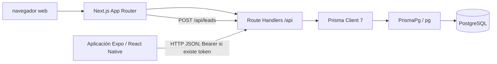

# Arquitectura

## Estado comprobado

PubliGana contiene tres áreas distintas bajo el repositorio Git: `Publigana/publigana-next` (web y API), `Publigana/publigana-mobile` (cliente Expo) y `Publigana/publigana-database` (archivos SQL y respaldos). No se encontró un workspace npm en la raíz Git ni una integración automatizada entre los archivos SQL y las migraciones Prisma.

## Componentes

| Componente | Responsabilidad observada | Estado |
| --- | --- | --- |
| Web Next.js | Sitio público en `/`, dashboard en `/dashboard`, demo en `/demo` y Route Handlers bajo `/api`. | Implementado |
| API Next.js | Registro/login, consulta de usuario, health check, leads y comprobación protegida de rol ADMIN. | Implementado; los alcances se detallan en [API](API.md). |
| Cliente móvil Expo | Navegación por archivos, pantallas de autenticación y áreas de promotor/empresa. | Implementado parcialmente; varios datos son estáticos. |
| PostgreSQL | Persistencia relacional para los modelos definidos por Prisma. | Configuración presente; instancia y conexión activas pendientes de verificar. |
| Prisma 7 + `@prisma/adapter-pg` | Cliente de base de datos en el servidor web. | Implementado; `DATABASE_URL` requerida al usar Prisma. |
| Archivos SQL separados | SQL de esquema, datos y backup en `Publigana/publigana-database`. | Presentes; sincronización con Prisma pendiente de verificar. |

## Diagrama de comunicación

El cliente móvil usa una URL base HTTP definida directamente en `Publigana/publigana-mobile/src/services/api.ts`; el valor actual es específico de la red de desarrollo y no se reproduce aquí. No se encontró configuración móvil por variable de entorno. La disponibilidad de la dirección desde un emulador, dispositivo o despliegue debe configurarse según el entorno.

## Aplicación web

La web usa Next.js App Router. La página raíz compone secciones de landing; el formulario de contacto envía leads a `/api/leads`. El dashboard solicita `/api/usuarios/me` y comprueba `ADMIN` en el cliente además de validar el token en el servidor. La API y la página web pertenecen a la misma aplicación Next.js.

## Aplicación móvil

Expo Router organiza pantallas en `src/app`: bienvenida, autenticación y áreas con pestañas de promotor y empresa. `AuthContext` restaura la sesión llamando a `GET /api/usuarios/me`; el cliente Axios añade el access token a las solicitudes. La navegación no constituye control de acceso del servidor.

Los servicios móviles de campañas, empresa, promotor y usuario existen como archivos pero están vacíos. Los paneles observados usan datos locales de ejemplo; no se confirma integración de esas pantallas con PostgreSQL.

## Persistencia

Solo el servidor Next.js importa Prisma y configura el adaptador PostgreSQL. La aplicación móvil se comunica con la API; no conecta directamente a la base. El esquema y las relaciones verificadas se describen en [Base de datos](DATABASE.md).

## Dependencias externas identificadas

- PostgreSQL, como servicio de persistencia requerido.
- Expo SecureStore para almacenar tokens en plataformas nativas; en web el almacenamiento usa `localStorage`.
- No se identificó integración activa con un proveedor de pagos, correo, almacenamiento de archivos ni API de redes sociales. La presencia de nombres o pantallas de redes sociales no prueba una integración.

## Pendiente de verificar

- Ubicación, versión, disponibilidad y credenciales de PostgreSQL.
- Si los SQL independientes representan el mismo estado que el esquema y las migraciones Prisma.
- URL base móvil correcta para cada entorno.
- Despliegue, infraestructura y servicios externos de producción.
