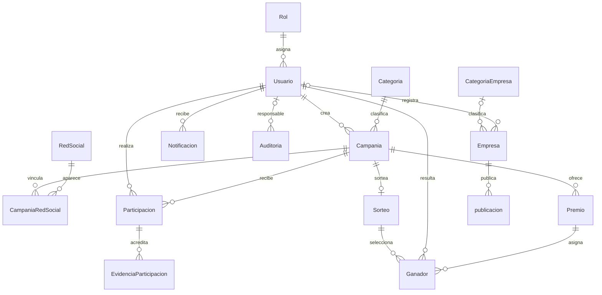

# Base de datos

## Motor y configuración

PostgreSQL es el proveedor declarado en `Publigana/publigana-next/prisma/schema.prisma` y `prisma/migrations/migration_lock.toml`. Prisma 7 usa el generador `prisma-client`, escribe el cliente generado en `app/generated/prisma` y recibe el origen mediante `PrismaPg` (`@prisma/adapter-pg`). `prisma.config.ts` define el esquema y obtiene `DATABASE_URL` con `env()`.

No se verificaron host, versión del servidor, credenciales, extensiones instaladas ni conexión activa. `gen_random_uuid()` aparece como default en el esquema y depende de la función disponible en PostgreSQL.

## Modelos

Los nombres y campos proceden del esquema. No hay bloques `enum`; los estados, tipos y roles son columnas `String` y no reciben validación enum de Prisma.

| Modelo | Clave primaria | Campos/índices únicos | Relaciones principales |
| --- | --- | --- | --- |
| `Rol` | `idRol` (`id_rol`) | `nombre` | Uno a muchos con `Usuario`. |
| `Usuario` | `id` UUID | `correo`; índices en `rolId` y `correo` | Pertenece a `Rol`; relacionado con empresas, campañas creadas, participaciones, ganadores, notificaciones y auditorías. |
| `CategoriaEmpresa` | `idCategoria` (`id_categoria`) BigInt | `nombre` | Uno a muchos con `Empresa`. |
| `Empresa` | `idEmpresa` (`id_empresa`) BigInt | `nit` | Puede pertenecer a `CategoriaEmpresa` y `Usuario`; uno a muchos con `publicacion`. |
| `Categoria` | `id` UUID | `nombre` | Uno a muchos con `Campania`. |
| `RedSocial` | `id` UUID | `nombre` | Unión muchos a muchos con `Campania` mediante `CampaniaRedSocial`. |
| `Campania` | `id` UUID | — | Pertenece a `Categoria` y a `Usuario` creador; tiene participaciones, premios, redes y cero o un sorteo. |
| `CampaniaRedSocial` | Compuesta: `campaniaId`, `redSocialId` | — | Une `Campania` con `RedSocial`. |
| `Premio` | `id` UUID | — | Pertenece a `Campania`; puede tener varios `Ganador`. |
| `Participacion` | `id` UUID | `codigoParticipacion` | Pertenece a `Usuario` y `Campania`; puede tener varias evidencias. |
| `EvidenciaParticipacion` | `id` UUID | — | Pertenece a `Participacion`. |
| `Sorteo` | `id` UUID | `campaniaId` | Pertenece a una `Campania`; tiene varios ganadores. |
| `Ganador` | `id` UUID | — | Pertenece a `Sorteo`, `Usuario` y `Premio`. |
| `Notificacion` | `id` UUID | — | Pertenece a `Usuario`. |
| `Auditoria` | `id` UUID | — | Puede pertenecer a un `Usuario` responsable; `entidadId` es un UUID sin relación Prisma declarada. |
| `publicacion` | `id` UUID (también anotado `@unique`) | Índice único `uq_publicacion_id` | Pertenece a `Empresa`. |
| `flyway_schema_history` | `installed_rank` | Índice en `success` | No tiene relaciones Prisma declaradas. |
| `leads` | `id` UUID | `correo` | No tiene relaciones Prisma declaradas. |

## Campos relevantes

- `Usuario`: correo, contraseña hash, estado `activo`, `rolId`, `ultimoAcceso`, perfil y fechas. `rolId` referencia `Rol.idRol`.
- `Empresa`: NIT único, estado opcional y referencias opcionales a usuario/categoría.
- `Campania`: título, descripción, fechas, estado booleano, creador y categoría.
- `Participacion`: código único, estado y referencias a usuario/campaña.
- `Sorteo`: referencia única a campaña, fecha, método y estado.
- `Ganador`: vínculos a sorteo, usuario y premio; conserva estado de notificación.
- `leads`: nombre, correo único, ciudad, tipo de usuario y fecha de registro.
- `publicacion`: contenido, enlace, estado, fechas programadas/publicadas y empresa.

La tabla registra textos libres para `estado`, `tipo`, `tipo_usuario`, `metodo` y `nombre` del rol. Los valores válidos y sus transiciones de negocio no se pueden deducir como restricciones de esquema.

## Relaciones y cardinalidades

Todas las relaciones declaradas aparecen en los campos `@relation` del esquema. Las referencias opcionales son `Empresa.idUsuario`, `Empresa.idCategoria` y `Auditoria.usuarioResponsableId`.

`CampaniaRedSocial` es una relación puente con clave primaria compuesta. `Sorteo.campaniaId` es único, por eso el esquema permite como máximo un sorteo por campaña. En el modelo Prisma, las relaciones uno-a-muchos descritas con `[]` pueden ser vacías.

## Claves, índices y restricciones

Las claves únicas identificadas incluyen `Rol.nombre`, `Usuario.correo`, `CategoriaEmpresa.nombre`, `Empresa.nit`, `Categoria.nombre`, `RedSocial.nombre`, `Participacion.codigoParticipacion`, `Sorteo.campaniaId`, `leads.correo` y la clave compuesta de `CampaniaRedSocial`. El SQL de línea base declara claves foráneas con `ON DELETE NO ACTION` y `ON UPDATE NO ACTION`; la migración posterior no cambia esa política.

El esquema también declara índices por claves foráneas en `Usuario`, `Empresa`, `Campania`, `Premio`, `Participacion`, `EvidenciaParticipacion`, `Ganador`, `Notificacion`, `Auditoria` y `publicacion`, además del índice `success` de `flyway_schema_history`. La definición Prisma de `publicacion.id` contiene `@id` y `@unique`; el SQL registra una clave primaria y un índice único.

## Migraciones

| Directorio | Contenido observado |
| --- | --- |
| `prisma/migrations/0_baseline` | Crea esquema `public`, tablas, índices y relaciones iniciales. |
| `prisma/migrations/20260920030123_init` | Añade `nit`, tabla `leads`, historial Flyway y cambios en usuario/índices. El SQL advierte que agregar `nit NOT NULL` sin default puede fallar con filas existentes y que índices únicos fallan ante duplicados. |

El lock declara proveedor `postgresql`. No se verificó el estado de migración de ninguna base real. No ejecutes estas migraciones sobre datos existentes sin respaldo y revisión del plan.

## Artefactos SQL paralelos

`Publigana/publigana-database` incluye `publigana_schema (1).sql`, `publigana_data.sql` y `publigana_backup.sql`. Su README menciona `publigana_schema.sql`, nombre distinto al que aparece en el directorio. No se confirmó que estos artefactos y las migraciones Prisma estén sincronizados. Determinar la fuente de verdad y validar el backup son pendientes.
